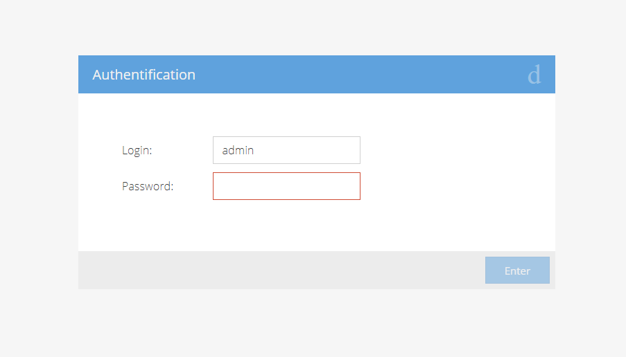
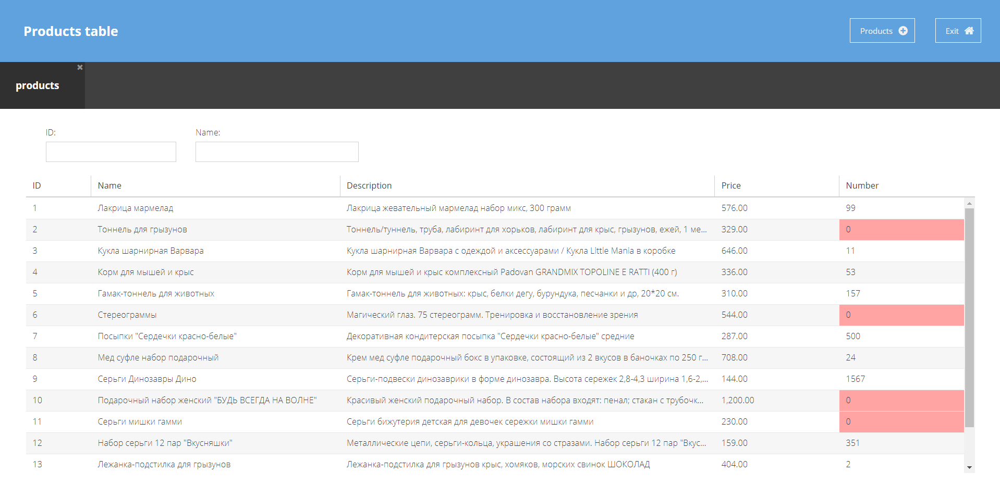
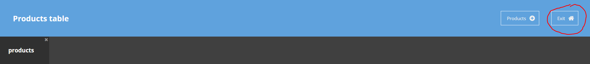
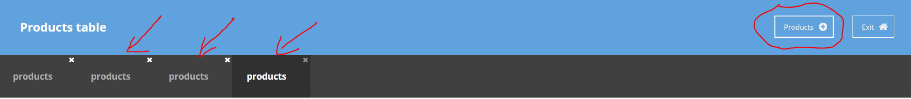
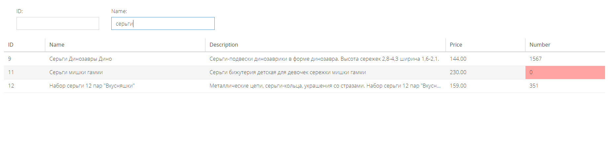
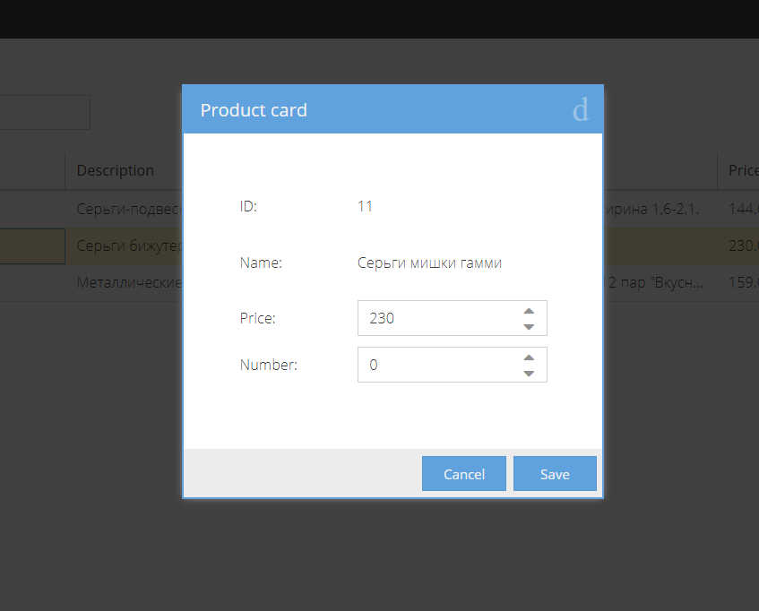
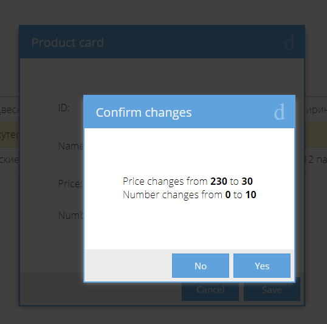

#  Products App

Desktop application for products analysis and modification using Extjs 6.0.0.

## Installation

1. [Download](https://www.sencha.com/products/extjs/evaluate/) sencha cmd (trial version).

2. Unzip and install downloaded cmd.

3. Clone repository (git clone https://github.com/chichivika/products) .

4. Download Extjs version 6.0.0 and put into the root of your project.
You can use this repo https://github.com/chichivika/ext6.0.0.640 for downloading.

5. In the folder of the project do "sencha app watch" command for starting the app. You will see it at http://localhost:1841 .

## How it works

### Login page

First of all, you need to enter your login and password. Choose wisely.
See folder <b>app/view/login</b> for code files.

### Main page

After successful login you will see the main page with a list of all products.
See folder <b>app/view/main</b> for code files.

You can exit to login page again by clickin the Ext-button in the top panel.

You can add a new products tab using Products-button in the top panel.

#### Table filters

You can use table filters by id and by name. Just write smth in the field and press 'Enter'.
To clear the filter just clear the field value.

See folder <b>app/view/filters</b> for code files.

#### Table

The table should update its height when window resize. Cells with zero number are colored with red.

By clicking Name-cell you can open a product card window.

See folder <b>app/view/table</b> for code files.

#### Product card window

You can change price or number in the product card. The field can`t be negative. Number should be integer.

After changing you can press Cancel-button to close window without saving or to press Save-button to save your changes.

Notice, that lists in different tabs update individually.

See folder <b>app/view/productWindow</b> and <b>app/view/productCard</b> for code files.

Before saving you should confirm your updates just in case. This logic you can find in <b>app/view/saveConfirmation</b> folder.

